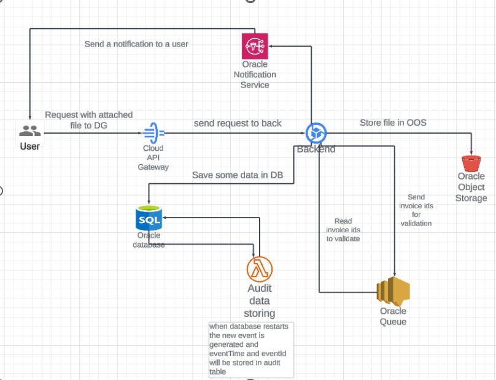

# Invoice Manager


## General info

It's a training project to investigate Oracle Cloud Infrastructure in usage.


Invoice Manager is a simple application aimed to manage invoices.
It allows us to register users, create/update/delete invoices and also validate them.

Invoice Manager features:
- receive requests by HTTP;
- store invoices, users, analytics in DB (Oracle Autonomous Database);
- send email notification to users (Oracle Notification Service);
- validate invoice (Oracle Queue Service and Invoice Manager Backend);
- store attached text files (Oracle Object Storage);
- collect some analytics data (Oracle Cloud Function).

## Technologies

Java 21
Gradle 7.4

OCI stack:
- [Oracle Autonomous Database](https://docs.oracle.com/en/cloud/paas/autonomous-database/index.html)
- [Oracle Notification Service](https://docs.oracle.com/en-us/iaas/Content/Notification/home.htm)
- [Oracle Queue Service](https://docs.oracle.com/en-us/iaas/Content/queue/home.htm)
- [Oracle Object Storage](https://docs.oracle.com/en-us/iaas/Content/Object/home.htm)
- [Oracle Cloud Function](https://docs.oracle.com/en-us/iaas/Content/Functions/home.htm)

## Setup

### Local development
 1. Set env variables:
    - OCI_CLI_FINGERPRINT
    - OCI_CLI_KEY_CONTENT
    - OCI_CLI_REGION
    - OCI_CLI_TENANCY
    - OCI_CLI_USER
    - OCI_DB_PASSWORD
    - OCI_DB_USER
 * If you use different OCI account please, double check following properties in application.yaml:
 topicId, compartmentId, nameSpace, bucketName, queue ocid, queue dlqOcid, queue endpoint, database url.

 2. Run application with IntelliJ IDEA, shell command or any other tool.
 3. Use postman_collection/invoiceManager.postman_collection.json to reach endpoints.

### Terraform scripts

To deploy whole the infrastructure use scripts from /terraform and [Oracle Cloud Resource Manager](https://docs.oracle.com/en-us/iaas/Content/ResourceManager/Concepts/resourcemanager.htm).

### OCI Function

Function is created to collect & resend information according to DB restart events.
Uses 'com.oraclecloud.databaseservice.restartautonomousdatabase.begin' event type to propagate event ID & event time to Audit Service.

To deploy function use:
```
fn deploy -v --app database_test
```

